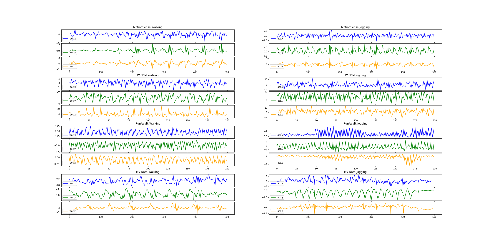
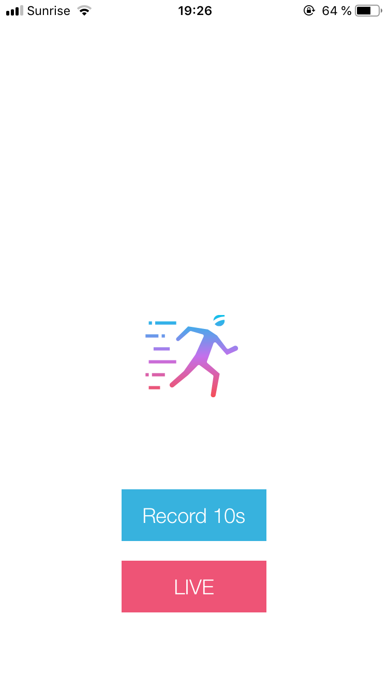
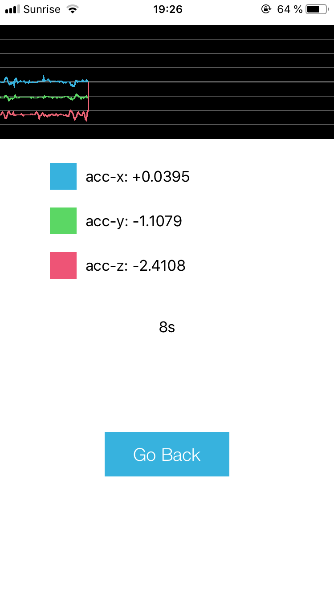
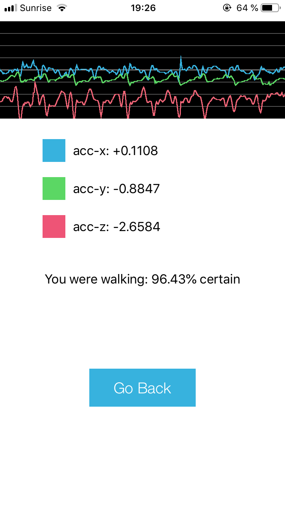
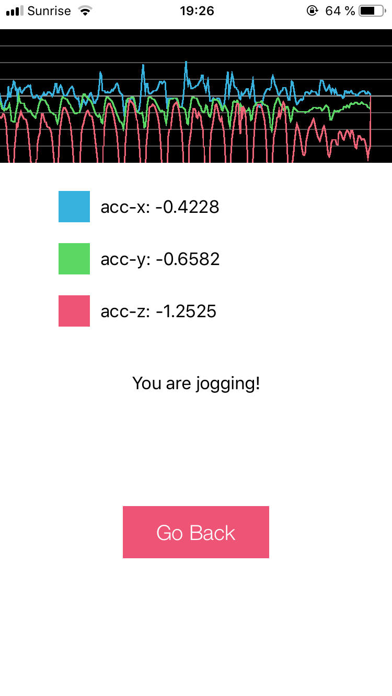

# Human Activity Recognition

This module contains code for analysing different datasets of smartphone sensor data as well 
as code for training and testing an LSTM and a CNN on predicting whether the recorded
sensor data was obtained from a running or a walking person. (As part of a challenge for a PhD position).
Goal of the challenge was to build a mobile app, which could classify 10 seconds of movement into 
`walking` or `jogging/running` activity.  

Each network is given a unique specifier. For each successful run, a folder with the 
network's specifier and the current datetime will be created with train and test results + the set of 
used hyperparameters.

### Datasets

1.  ***WISDM*** 
The Wireless Sensor Data Mining (WISDM) Lab has provided two datasets, which 
contain accelerator measurements. I have used the lab data (not the actitracker)

    > - [dataset](http://www.cis.fordham.edu/wisdm)
    > - [paper](http://www.cis.fordham.edu/wisdm/public_files/sensorKDD-2010.pdf)
    > - Sampling rate = 20Hz 
    > - Device = Android
    > - Carried in front pocket
    > - Feature set: downstairs, upstairs, walking, jogging, sitting, and standing

2. ***MotionSense***
    > - [dataset](https://www.kaggle.com/malekzadeh/motionsense-dataset)
    > - [paper](https://arxiv.org/pdf/1802.07802.pdf)
    > - Sampling rate = 50Hz 
    > - Device = iPhone6
    > - Carried in front pocket
    > - Feature set: downstairs, upstairs, walking, jogging, sitting, and standing

3. ***Run/Walk***
    > - [data](https://www.kaggle.com/vmalyi/run-or-walk)
    > - Sampling rate = 50Hz 
    > - Device = iPhone5
    > - Carried on left and right wrist
    > - Feature set: walking, jogging

4. ***My iPhone Data***
    > - in `data/my_iphone_data`
    > - Sampling rate = 50Hz 
    > - Device = iPhone8
    > - Carried in front pocket
    > - Feature set: walking, jogging



### Results on motionSense data
I have randomly split the train and test sets in a ratio of 75:25. 
As we want 10 seconds of data and motionSense was recorded with 50Hz, we need
10/(1/50) datapoints - therefore each sample contains 500 `[acc.x, acc.y, acc.z]` measurements. 
For both, CNN and LSTM, I reach close to 100% on the test set (It is a very simple classification task)

### Usage 
1. Clone repository and download all datasets
    ```
    git clone git@github.ibm.com:mariozusag/ios_human_activity_recognition.git
    ```
2. Install dependencies
    
    (suggested) Install with `virtual environment`
    ```
    cd ios_human_activity_recognition
    python3 -m venv har_env
    source har_env/bin/activate
    pip3 install -r requirements.txt
    ```
    (alternative) Install with `pip version 3.5` or `3.6`
    ```
    cd ios_human_activity_recognition
    pip3 install -r requirements.txt
    ```
    
3. Project structure
    
    ```
    cd ios_human_activity_recognition
    cd data
    mkdir motion_sense output run_walk train_test wisdm_lab
    mv ../all_motionSenseData/* data/motion_sense
    mv ../all_wisdmDataLab/* data/wisdm_lab
    mv ../all_RunWalkDataLab/* data/run_walk
    ```
    ```
    data
    ├── motion_sense      # folder with all motionSense data (just put them there like you downloaded them)
    ├── my_iphone_data    # folder with two 10s  measurements from my iPhone
    ├── output    # output folder, where the results of the deep learning models are saved to
    │   ├── experimental_results
    │       ├── LSTM_2019-03-12-22:18:28
    ├── ...
    │
    docs
    ├── resources       
    │
    src
    ├── model 
    │   ├── cnn.py   # convolutional neural network for human activity recognition      
    │   ├── keras_base_model.py      # framework for keras models    
    │   ├── lstm.py   # recurrent neural network for human activity recognition                
    │   └── transform_into_coreml.py    # transform a trained .h5 model into a CoreML model, which can be deployed on an iPhone                  
    ├── preprocessing 
    │   ├── data_loader.py      # loads each data into a DataFrame
    │   ├── train_test_split.py   # transforms a DataFrame to train/test data for Human Activity Recognitin
    ├── visualization 
    │   ├── visalization.py      # visualizes accelerometer data
    ├── utilities.py    # set of utility functions
    │
    iOS-Human-Activity-Recognition.ipynb    # a Jupyter Notebook going through all the steps of the module
    │
    tests
    ├── unittests 
    
    ```

4. Running the module

    ```
    cd ios_human_activity_recognition
    jupyter notebook
    ```
    Then open and run the iOS-Human-Activity-Recognition.ipynb step for step

### iOS App
The code for the iOS App can be found here: https://github.com/mariozusag/activity-prediction-app

### Screenshots
Homescreen                 |  10s screen               |  10s prediction           | Live version  
:-------------------------:|:-------------------------:|:-------------------------:|:-------------------------:
    |           | | 
